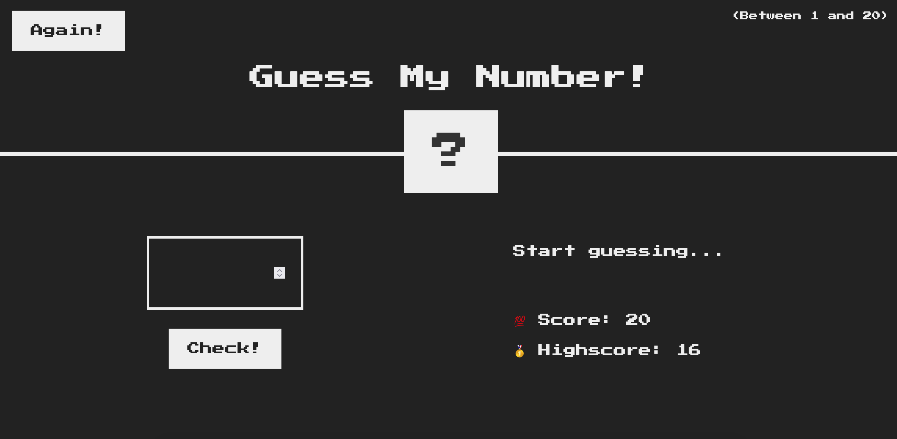
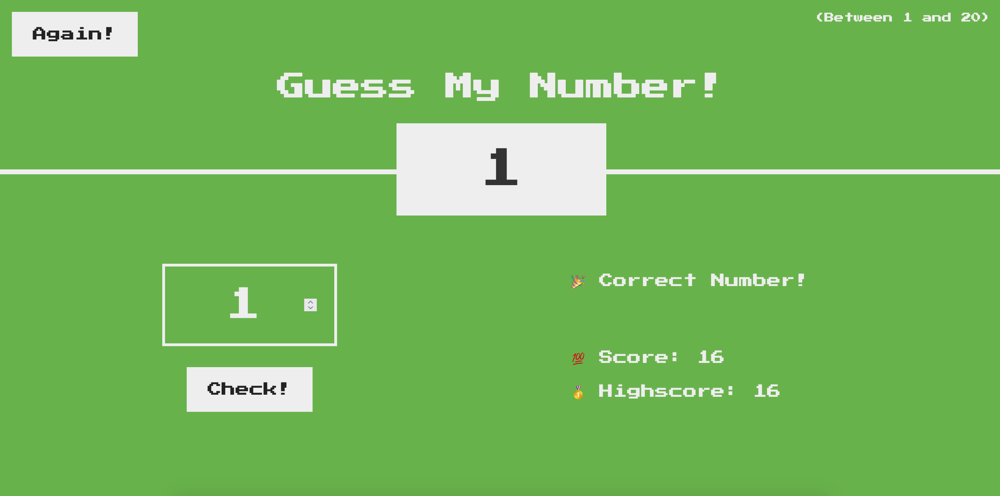

# Guess-The-Number

A Vanilla JS Game where user is expected to guess the correct number between 1 and 20. Completed as part of the JS Tutorial from Udemy (https://www.udemy.com/course/the-complete-javascript-course/).
In the recent updates I have made the webpage responsive.

# Link to Game

```
https://captv89.github.io/guess-the-number/index.html
```

# Screen Shots

## Start a Game!


## Win the Game!
